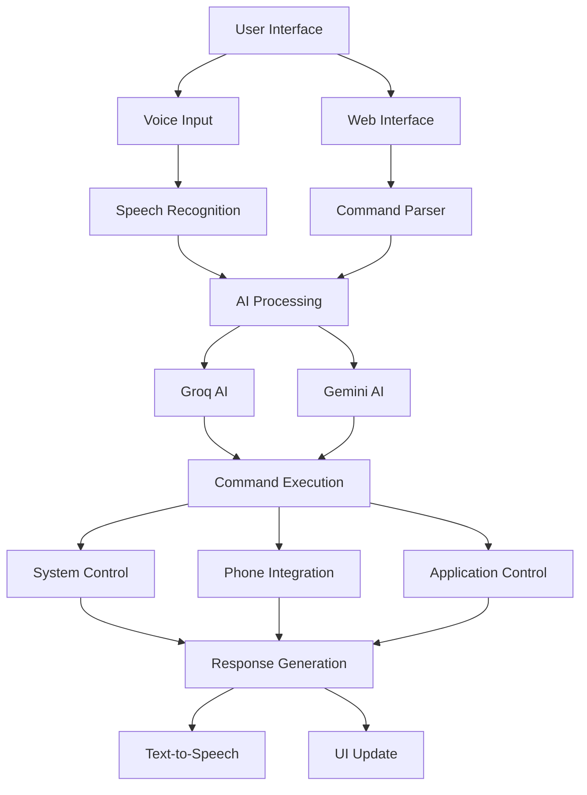

# 🤖 JARVIS AI Assistant

[](https://python.org)
[](LICENSE)
[]()
[]()

> An advanced AI-powered virtual assistant with voice recognition, face authentication, phone integration, and intelligent automation capabilities.

## 📋 Table of Contents

- [Overview](#overview)
- [Features](#features)
- [Architecture](#architecture)
- [Tech Stack](#tech-stack)
- [Installation](#installation)
- [How to Run](#how-to-run)
- [Screenshots](#screenshots)
- [Configuration](#configuration)
- [Usage Examples](#usage-examples)
- [API Documentation](#api-documentation)
- [Contributing](#contributing)
- [Future Improvements](#future-improvements)
- [License](#license)
- [Credits](#credits)

## 🎯 Overview

JARVIS AI Assistant is a sophisticated virtual assistant that combines cutting-edge AI technologies with practical automation features. Built with Python and modern web technologies, it offers voice-controlled interactions, biometric authentication, phone integration, and intelligent task automation.

The assistant leverages multiple AI providers (Groq, Google Gemini) for natural language processing and provides a sleek web-based interface for seamless user interaction.

## ✨ Features

### 🔐 **Biometric Authentication**
- **Face Recognition**: Advanced facial authentication using OpenCV
- **Fingerprint Authentication**: Android device fingerprint integration via ADB
- **Dual Authentication**: Combined face + fingerprint security

### 🎤 **Voice & Speech**
- **Speech Recognition**: Real-time voice command processing
- **Text-to-Speech**: Natural voice responses with gender selection
- **Multilingual Support**: Multiple language support
- **Hotword Detection**: Wake word activation ("Hey Jarvis")
- **Continuous Listening**: Always-on voice mode

### 🤖 **AI Integration**
- **Groq AI**: Fast language model processing
- **Google Gemini**: Advanced conversational AI
- **Dual AI System**: Fallback AI providers for reliability
- **Personality Manager**: Customizable AI personality and response styles
- **Context Awareness**: Intelligent conversation memory

### 📱 **Phone Integration**
- **SMS Management**: Read, send, and manage text messages
- **Call Notifications**: Incoming call alerts and management
- **WhatsApp Integration**: Send messages via WhatsApp
- **Phone Control**: Remote phone operations via ADB

### 🖥️ **System Control**
- **Application Management**: Open, close, and control applications
- **File Operations**: File and folder management
- **System Monitoring**: CPU, memory, and system stats
- **Automation**: Scheduled tasks and reminders
- **Screen Control**: Screenshot capture and display control

### 🌐 **Web Interface**
- **Modern UI**: Sleek web-based control panel
- **Real-time Updates**: Live status monitoring
- **Settings Management**: Easy configuration interface
- **Command History**: Track and search past commands
- **Visual Feedback**: Interactive animations and notifications

### 🧠 **Smart Features**
- **Emotion Detection**: Analyze user emotions from voice
- **Proactive Suggestions**: AI-powered usage recommendations
- **Learning System**: Adaptive behavior based on usage patterns
- **Command History**: Comprehensive command tracking and analytics
- **Auto-start**: System startup integration

## 🏗️ Architecture

```
JARVIS AI Assistant
├── Frontend (Web UI)
│   ├── HTML/CSS/JavaScript
│   ├── Eel Framework
│   └── Real-time Communication
├── Core Engine
│   ├── Voice Processing
│   ├── AI Integration
│   ├── Command Processing
│   └── Authentication
├── System Integration
│   ├── Phone Control (ADB)
│   ├── Application Control
│   ├── File Management
│   └── System Monitoring
└── Data Layer
    ├── User Profiles
    ├── Command History
    ├── Configuration
    └── Authentication Data
```

### 📊 Architecture Diagram



## 🛠️ Tech Stack

### **Core Technologies**
- **Python 3.7+**: Main programming language
- **Eel**: Python-JavaScript bridge for web UI
- **OpenCV**: Computer vision and face recognition
- **SpeechRecognition**: Voice input processing
- **pyttsx3**: Text-to-speech synthesis

### **AI & Machine Learning**
- **Groq**: Fast language model API
- **Google Generative AI**: Advanced conversational AI
- **Transformers**: Hugging Face transformers library
- **PyTorch**: Deep learning framework

### **System Integration**
- **PyAutoGUI**: GUI automation
- **psutil**: System monitoring
- **ADB**: Android device control
- **PyQt5**: Desktop application framework

### **Web Technologies**
- **HTML5/CSS3**: Modern web interface
- **JavaScript**: Interactive frontend
- **WebSocket**: Real-time communication

### **Additional Libraries**
- **Requests**: HTTP client
- **Cryptography**: Security and encryption
- **Schedule**: Task scheduling
- **Matplotlib**: Data visualization
- **Pillow**: Image processing

## 🚀 Installation

### Prerequisites

- **Python 3.7 or higher**
- **Windows 10/11** (Primary support)
- **Android device** (Optional, for phone features)
- **Microphone** (For voice commands)
- **Webcam** (For face authentication)

### Quick Installation

1. **Clone the repository**
   ```bash
   git clone https://github.com/Roopkumar213/Jarvis-AI.git
   cd Jarvis-AI
   ```

2. **Run the automated installer**
   ```bash
   install.bat
   ```

### Manual Installation

1. **Install Python dependencies**
   ```bash
   pip install -r requirements.txt
   ```

2. **Set up API keys**
   ```bash
   # Edit groq_config.py
   GROQ_API_KEY = "your-groq-api-key-here"
   
   # Edit gemini_config.py
   GEMINI_API_KEY = "your-gemini-api-key-here"
   ```

3. **Configure phone integration (Optional)**
   ```bash
   # Enable USB debugging on Android device
   # Install ADB tools
   # Run: python setup_phone_link.py
   ```

4. **Set up face authentication (Optional)**
   ```bash
   python setup_face_auth.py
   ```

## 🎮 How to Run

### Standard Mode
```bash
python run.py
```

### Development Mode
```bash
python main.py
```

### Features Setup
```bash
# Face authentication setup
python setup_face_auth.py

# Phone integration setup
python setup_phone_link.py

# Add new user
python add_user.py
```

### Voice Commands Examples
- "Hey Jarvis, what's the weather?"
- "Open calculator"
- "Send message to John"
- "Take a screenshot"
- "What's my system status?"

## 📸 Screenshots

### Main Interface

*Modern web-based control interface*

### Voice Command Processing

*Real-time command processing and history*

### Settings Panel

*Comprehensive settings and configuration*

### Initialization Screen

*System startup and authentication*


## ⚙️ Configuration

### API Configuration
```python
# groq_config.py
GROQ_API_KEY = "your-groq-api-key"

# gemini_config.py
GEMINI_API_KEY = "your-gemini-api-key"
```

### Voice Settings
```json
{
  "gender": "male",
  "speed": "normal",
  "volume": "medium"
}
```

### Biometric Settings
```json
{
  "face_auth_enabled": true,
  "fingerprint_auth_enabled": true
}
```

## 📚 Usage Examples

### Voice Commands
```python
# System Control
"open notepad"
"close chrome"
"take screenshot"
"show system stats"

# Phone Integration
"send message to John"
"call mom"
"read my messages"

# AI Queries
"what's the weather today?"
"tell me a joke"
"explain quantum physics"
"create a presentation about AI"
```

### Programmatic Usage
```python
from engine.command import allCommands
from engine.dual_ai import get_simple_response

# Execute command
allCommands("open calculator")

# Get AI response
response = get_simple_response("What's the capital of France?")
print(response)
```

## 🔮 Future Improvements

### Planned Features
- [ ] **Mobile App**: Native Android/iOS companion app
- [ ] **Smart Home Integration**: IoT device control
- [ ] **Advanced NLP**: Custom language model training
- [ ] **Video Calling**: Integrated video communication
- [ ] **Calendar Integration**: Google Calendar sync
- [ ] **Email Management**: Advanced email automation
- [ ] **Document Processing**: PDF and document analysis
- [ ] **Voice Cloning**: Personalized voice synthesis
- [ ] **Multi-user Support**: Family/team profiles
- [ ] **Cloud Sync**: Cross-device synchronization

### Technical Improvements
- [ ] **Performance Optimization**: Faster response times
- [ ] **Memory Management**: Reduced resource usage
- [ ] **Security Enhancements**: Advanced encryption
- [ ] **Cross-platform Support**: Linux and macOS compatibility
- [ ] **Plugin System**: Extensible architecture
- [ ] **API Gateway**: RESTful API for third-party integration

## 🤝 Contributing

We welcome contributions! Please see our [Contributing Guidelines](CONTRIBUTING.md) for details.

### Development Setup
1. Fork the repository
2. Create a feature branch
3. Make your changes
4. Add tests
5. Submit a pull request

### Code Style
- Follow PEP 8 guidelines
- Use meaningful variable names
- Add docstrings to functions
- Include type hints where appropriate

## 📄 License

This project is licensed under the MIT License - see the [LICENSE](LICENSE) file for details.

```
MIT License

Copyright (c) 2024-2026 A ROOP KUMAR

Permission is hereby granted, free of charge, to any person obtaining a copy
of this software and associated documentation files (the "Software"), to deal
in the Software without restriction, including without limitation the rights
to use, copy, modify, merge, publish, distribute, sublicense, and/or sell
copies of the Software, and to permit persons to whom the Software is
furnished to do so, subject to the following conditions:

The above copyright notice and this permission notice shall be included in all
copies or substantial portions of the Software.
```

## 🙏 Credits

### Development Team
- **Lead Developer**: A ROOP KUMAR
- **AI Integration**: Ollama, Groq & Gemini API fallback system
- **UI/UX Design**: Modern web interface
- **System Integration**: Phone and system control

### Technologies & Libraries
- **OpenCV**: Computer vision capabilities
- **Groq**: High-performance AI inference
- **Google AI**: Advanced language models
- **Python Community**: Extensive library ecosystem

### Special Thanks
- **Open Source Community**: For amazing libraries and tools
- **Beta Testers**: For valuable feedback and testing
- **Contributors**: For code contributions and improvements

### Inspiration
Inspired by the fictional JARVIS AI from Marvel's Iron Man series, this project aims to bring advanced AI assistance to everyday computing.

---

## 📞 Support

For support, questions, or feature requests:

- **Issues**: [GitHub Issues](https://github.com/Roopkumar213/Jarvis-AI/issues)
- **Discussions**: [GitHub Discussions](https://github.com/Roopkumar213/Jarvis-AI/discussions)
- **Contact**: Create an issue for support

---

**Made with ❤️ by A ROOP KUMAR**

*"Sometimes you gotta run before you can walk." - Tony Stark*
