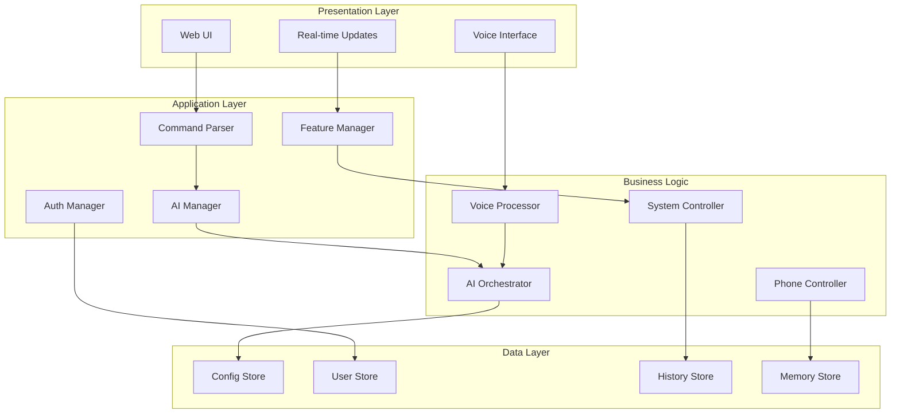

# JARVIS AI Assistant - Architecture Documentation

## System Architecture Overview

The JARVIS AI Assistant follows a modular, layered architecture designed for scalability, maintainability, and extensibility.

## Architecture Layers

### 1. Presentation Layer
- **Web UI**: Modern HTML5/CSS3/JavaScript interface
- **Voice Interface**: Speech recognition and synthesis
- **Real-time Communication**: WebSocket connections via Eel framework

### 2. Application Layer
- **Command Processing**: Natural language command interpretation
- **AI Integration**: Multiple AI provider management
- **Authentication**: Biometric security systems
- **Feature Management**: Modular feature system

### 3. Business Logic Layer
- **Voice Processing**: Speech-to-text and text-to-speech
- **AI Orchestration**: Dual AI system with fallback
- **System Control**: Application and file management
- **Phone Integration**: Android device communication

### 4. Data Access Layer
- **Configuration Management**: JSON-based settings
- **User Profiles**: Authentication and personalization data
- **Command History**: Usage tracking and analytics
- **Memory Systems**: Long-term and adaptive memory

### 5. Infrastructure Layer
- **System APIs**: Windows system integration
- **Device Communication**: ADB for Android devices
- **Network Services**: HTTP/WebSocket communication
- **File System**: Local storage and file operations

## Component Diagram



## Data Flow Architecture

### Voice Command Flow
1. **Voice Input** → Speech Recognition
2. **Text Processing** → Command Parser
3. **Intent Recognition** → AI Processing
4. **Command Execution** → System/Phone Control
5. **Response Generation** → Text-to-Speech
6. **UI Update** → Real-time Feedback

### Authentication Flow
1. **Biometric Input** → Face/Fingerprint Recognition
2. **Identity Verification** → User Database Lookup
3. **Access Control** → Permission Validation
4. **Session Management** → User Context Loading

## Security Architecture

### Authentication Layers
- **Biometric Authentication**: Face recognition + Fingerprint
- **Device Authentication**: Android device pairing
- **Session Management**: Secure user sessions
- **Data Encryption**: Sensitive data protection

### Security Measures
- **API Key Protection**: Encrypted storage
- **User Data Privacy**: Local storage only
- **Communication Security**: Encrypted channels
- **Access Control**: Role-based permissions

## Scalability Considerations

### Horizontal Scaling
- **Modular Design**: Independent feature modules
- **Plugin Architecture**: Extensible functionality
- **API Gateway**: External service integration
- **Microservices Ready**: Service decomposition potential

### Performance Optimization
- **Async Processing**: Non-blocking operations
- **Caching Strategy**: Intelligent data caching
- **Resource Management**: Memory and CPU optimization
- **Load Balancing**: Multi-process architecture

## Technology Stack Integration

### Core Technologies
```
Python 3.7+ (Core Runtime)
├── Eel (Web Framework)
├── OpenCV (Computer Vision)
├── SpeechRecognition (Voice Input)
└── pyttsx3 (Voice Output)
```

### AI Integration
```
AI Providers
├── Groq (Primary AI)
├── Google Gemini (Secondary AI)
├── Transformers (Local Models)
└── Custom Models (Future)
```

### System Integration
```
System APIs
├── Windows APIs (System Control)
├── ADB (Android Integration)
├── PyAutoGUI (GUI Automation)
└── psutil (System Monitoring)
```

## Deployment Architecture

### Development Environment
- **Local Development**: Python virtual environment
- **Hot Reload**: Eel development server
- **Debug Mode**: Comprehensive logging
- **Testing Framework**: Automated testing

### Production Environment
- **Standalone Application**: Packaged executable
- **System Service**: Background service mode
- **Auto-start**: System startup integration
- **Update Mechanism**: Automatic updates

## Future Architecture Evolution

### Planned Enhancements
- **Cloud Integration**: Hybrid cloud-local architecture
- **Mobile Apps**: Native mobile companions
- **IoT Integration**: Smart home device control
- **Distributed Processing**: Multi-device coordination

### Architectural Patterns
- **Event-Driven Architecture**: Reactive system design
- **CQRS Pattern**: Command-query separation
- **Observer Pattern**: Real-time notifications
- **Strategy Pattern**: Pluggable AI providers