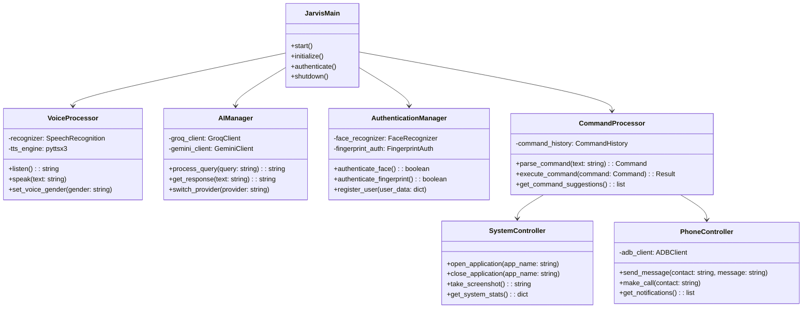
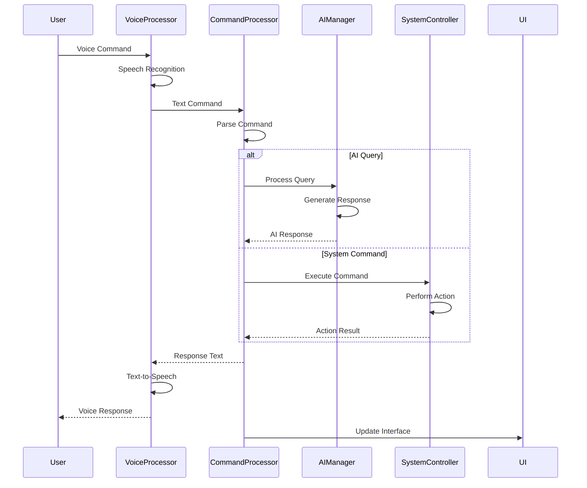
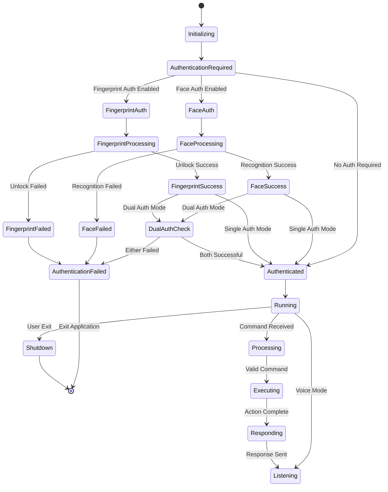
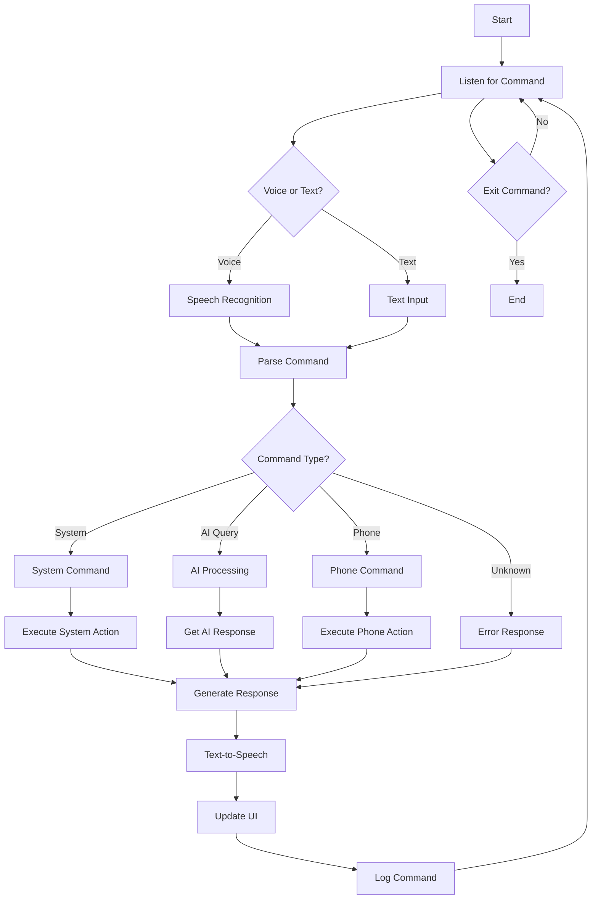
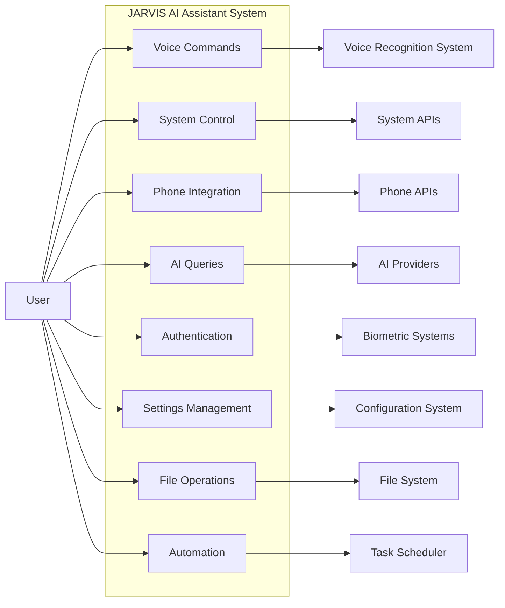
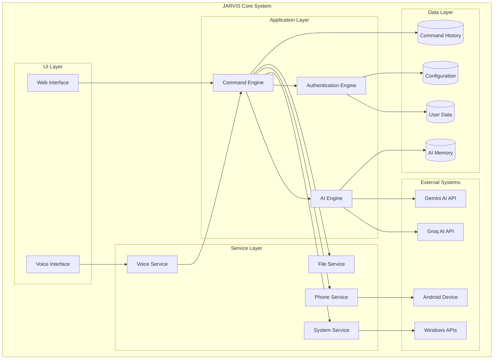
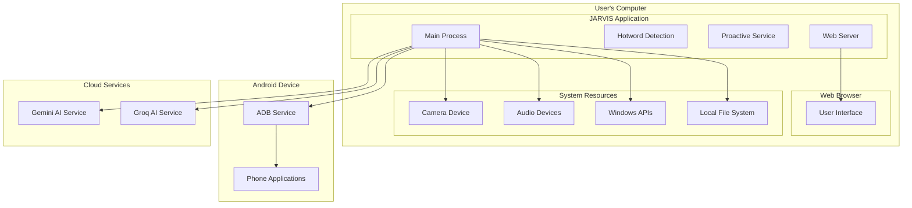
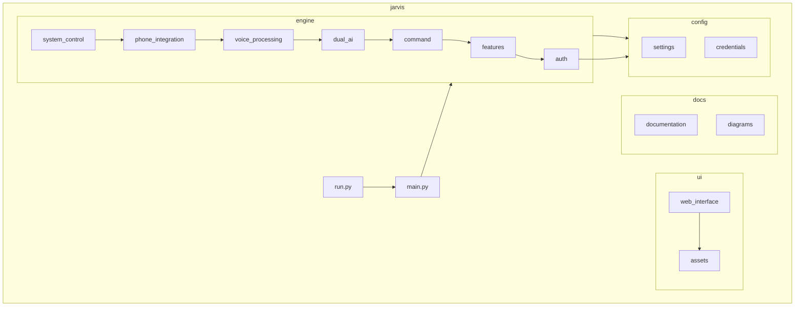

# JARVIS AI Assistant - UML Diagrams

## Class Diagram

## Sequence Diagram - Voice Command Processing

## State Diagram - Authentication Flow

## Activity Diagram - Command Execution Flow

## Use Case Diagram

## Component Diagram

## Deployment Diagram

## Package Diagram

